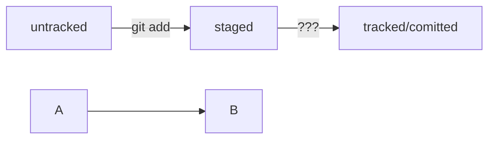

[MARKDOWN CHEAT SHEET](https://www.markdownguide.org/cheat-sheet/ "Markdown cheat sheet")

**new level**

[формат описания схем Mermaid](https://github.blog/2022-02-14-include-diagrams-markdown-files-mermaid/)

